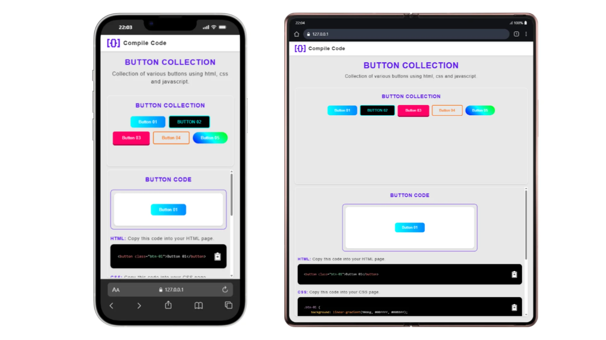

---

## 📸 Preview


---

# 🎨 Button Collection | Compile Code

Uma coleção interativa de **botões estilizados com HTML, CSS e JavaScript**, criada para ajudar desenvolvedores e designers a explorar e copiar rapidamente diferentes estilos de botões.

O projeto exibe uma **prévia visual** do botão selecionado e mostra o código correspondente (HTML, CSS e JS) com **realce de sintaxe** usando [Prism.js](https://prismjs.com/).
Cada trecho pode ser **copiado com um clique**, facilitando o uso em outros projetos.

---

<!-- HEADER -->
<div align="center">

# 🎨 **Button Collection | Compile Code**

✨ Coleção interativa de botões estilizados com **HTML**, **CSS** e **JavaScript** — explore, copie e use em seus próprios projetos.


<br>

🖥️ **Preview Responsivo | Painel de Código Interativo | Realce de Sintaxe Automático**

</div>

---

## 🧭 **Sumário**
- [Sobre o Projeto](#-sobre-o-projeto)
- [Demonstração](#-demonstração)
- [Funcionalidades](#-funcionalidades)
- [Tecnologias](#-tecnologias)
- [Como Usar](#-como-usar)
- [Estrutura](#-estrutura)
- [Conceitos Envolvidos](#-conceitos-envolvidos)
- [Próximas Atualizações](#-próximas-atualizações)
- [Autor](#-autor)

---

## 💡 **Sobre o Projeto**

O **Button Collection** é uma biblioteca visual e interativa que permite:
> 🔹 Explorar diferentes estilos de botões  
> 🔹 Ver o código correspondente (HTML, CSS, JS)  
> 🔹 Copiar o código com apenas um clique  

O projeto foi desenvolvido com foco em **aprendizado, inspiração e reutilização** — ideal para quem quer entender na prática como construir botões criativos e responsivos.

---

## 📱 **Demonstração**

<p align="center">
  
  
</p>

> 💡 O layout é **totalmente responsivo**, adaptando-se a telas pequenas e incluindo um **painel de código expansível/recolhível** com animação suave.

---

## ⚙️ **Funcionalidades**

✅ Exibição de botões com diferentes estilos  
✅ Painel de código dinâmico com realce de sintaxe (Prism.js)  
✅ Botão “Copiar código” com feedback visual  
✅ Layout responsivo com **media queries**  
✅ Interação fluida com animações CSS  
✅ Fechamento automático ao clicar fora no mobile  

---

## 🧩 **Tecnologias**

| Tecnologia | Função |
|-------------|--------|
| 🧱 **HTML5** | Estrutura e semântica |
| 🎨 **CSS3** | Estilização e responsividade |
| ⚡ **JavaScript (ES6)** | Interatividade e controle do painel |
| 🌈 **Prism.js** | Realce de sintaxe do código |
| 🧭 **Media Queries** | Layout adaptável a diferentes telas |

---

## 🚀 **Como Usar**

```bash
# 1️⃣ Clone o repositório
git clone https://github.com/hedimauro260/button-collection.git

# 2️⃣ Acesse a pasta do projeto
cd button-collection

# 3️⃣ Abra no navegador
start index.html
```

💡 *Não requer dependências externas — funciona direto no navegador.*

---

## 🧩 Estrutura do Projeto

```bash
📁 button-collection/
│
├── index.html        # Estrutura principal
├── style.css         # Estilos e media queries
├── script.js         # Interações e painel dinâmico
│
├── assets/
│   ├── screenshot-01.webp
│   ├── screenshot-02.webp
│   └── logo-3.png
│   
│
└── README.md
```

---

## 🖥️ Tecnologias Utilizadas

* **HTML5** – Estrutura da página e semântica
* **CSS3** – Estilização e layout responsivo
* **JavaScript (ES6)** – Lógica de exibição e cópia de código
* **[Prism.js](https://prismjs.com/)** – Realce de sintaxe de código
* **Favicon personalizado** – Identidade visual do projeto

---

## ⚙️ Funcionalidades

✅ Exibição visual de diferentes botões
✅ Mostra o código HTML, CSS e JS de cada botão
✅ Botão de **"Copiar código"** com feedback visual
✅ Realce automático de sintaxe
✅ Interface simples e responsiva

---

## 🧠 **Conceitos Envolvidos**

🔸 Manipulação de DOM
🔸 Eventos (`click`, `DOMContentLoaded`)
🔸 Template strings e arrays de objetos
🔸 Responsividade com media queries
🔸 Transições CSS e controle de altura via JS
🔸 Feedback visual e UX interativo
🔸 Uso de bibliotecas externas (Prism.js)
🔸 UX focada em mobile-first

---

## 🧱 Estrutura dos Botões

Cada botão é armazenado como um objeto dentro de um array JavaScript:

```js
{
  name: "Button 01",
  html: "<button class='btn-01'>Button 01</button>",
  css: ".btn-01 { background: #00ffff; }",
  js: "// Nenhum JS usado neste botão"
}
```

Isso facilita adicionar novos botões à coleção.

---

## 🔮 **Próximas Atualizações**

| Recurso                                     | Status                |
| ------------------------------------------- | --------------------- |
| 🧱 Agrupar em categorias                    | 🟡 Em desenvolvimento |
| 🌗 Arquivo JSON com os botões               | ⚪ Planejado          |
| 🌗 Modo claro/escuro                        | ⚪ Planejado          |
| 🎨 Personalizador de cores ao vivo          | ⚪ Planejado           |
| 💾 Download automático do código            | ⚪ Planejado           |
| 🌐 Publicação no GitHub Pages               | 🟢 Em breve           |

---

## 👨‍💻 **Autor**

<div align="center">

Desenvolvido por **Hedi Mauro**
💼 Front-end Developer | 💡 Entusiasta de UI/UX e SaaS

📫 [Entre em contato comigo](mailto:hedimauro260@gmail.com)
🌎 [Portfólio](https://seudominio.com) | 🐙 [GitHub](https://github.com/hedimauro260)

</div>

---

## 🏷️ **Licença**

Este projeto está sob a licença **MIT** — veja o arquivo [LICENSE](LICENSE) para mais detalhes.

---

<div align="center">

⭐ Se este projeto te ajudou, **dá uma estrela** no repositório!
Feito com 💛 por [Hedi Mauro](https://github.com/hedimauro260)

</div>

---
