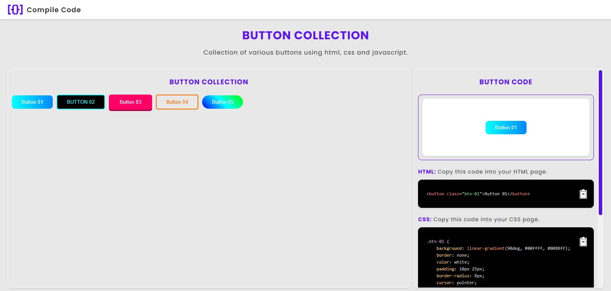

# 🎨 Button Collection | Compile Code

Uma coleção interativa de **botões estilizados com HTML, CSS e JavaScript**, criada para ajudar desenvolvedores e designers a explorar e copiar rapidamente diferentes estilos de botões.

O projeto exibe uma **prévia visual** do botão selecionado e mostra o código correspondente (HTML, CSS e JS) com **realce de sintaxe** usando [Prism.js](https://prismjs.com/).
Cada trecho pode ser **copiado com um clique**, facilitando o uso em outros projetos.

---

## 🚀 Demonstração

🔹 **Visualiza todos os botões**
🔹 **Copia os códigos com um clique**
🔹 **Alterna entre os diferentes estilos com pré-visualização dinâmica**

> 💡 Ideal para quem quer estudar efeitos de botões, construir interfaces modernas ou acelerar o desenvolvimento de front-ends.

---

## 🧩 Estrutura do Projeto

```
📁 button-collection/
│
├── index.html        # Estrutura principal da aplicação
├── style.css         # Estilos e layout da interface
├── script.js         # Lógica para trocar botões e copiar código
│
├── assets/
│   └── images/
│       └── logo-3.png
│
└── README.md
```

---

## 🖥️ Tecnologias Utilizadas

* **HTML5** – Estrutura da página e semântica
* **CSS3** – Estilização e layout responsivo
* **JavaScript (ES6)** – Lógica de exibição e cópia de código
* **[Prism.js](https://prismjs.com/)** – Realce de sintaxe de código
* **Favicon personalizado** – Identidade visual do projeto

---

## ⚙️ Funcionalidades

✅ Exibição visual de diferentes botões
✅ Mostra o código HTML, CSS e JS de cada botão
✅ Botão de **"Copiar código"** com feedback visual
✅ Realce automático de sintaxe
✅ Interface simples e responsiva

---

## 📦 Como Usar

1. Clone o repositório:

   ```bash
   git clone https://github.com/seu-usuario/button-collection.git
   ```

2. Abra o arquivo `index.html` diretamente no navegador.

3. Clique nos botões para ver o código e use o ícone de copiar para reutilizar no seu projeto.

---

## 🧠 Conceitos Envolvidos

* Manipulação do DOM com JavaScript
* Eventos (`click`, `DOMContentLoaded`)
* Template strings e arrays de objetos
* Efeitos de transição e animação em CSS
* Uso de bibliotecas externas (Prism.js)
* Feedback visual e UX interativo

---

## 🧱 Estrutura dos Botões

Cada botão é armazenado como um objeto dentro de um array JavaScript:

```js
{
  name: "Button 01",
  html: "<button class='btn-01'>Button 01</button>",
  css: ".btn-01 { background: #00ffff; }",
  js: "// Nenhum JS usado neste botão"
}
```

Isso facilita adicionar novos botões à coleção.

---

## 🔮 Possíveis Atualizações Futuras

✨ **Modo claro/escuro**
🎨 **Personalizador de cores** (para editar o gradiente e visualizar em tempo real)
🧱 **Categorias de botões** (flat, neon, 3D, glassmorphism, etc.)
💾 **Download automático** do código como `.zip`
🌐 **Versão online hospedada (GitHub Pages / Vercel)**
📱 **Design totalmente responsivo para mobile**
🔍 **Busca e filtro de botões por nome ou estilo**
🧠 **Explicação visual de cada efeito CSS** (por exemplo: hover, shadow, gradient)

---

## 🧑‍💻 Autor

Desenvolvido por **Hedi Mauro**
📘 Projeto experimental para estudo e portfólio.

Se gostou do projeto, ⭐ **marque o repositório com uma estrela** no GitHub e compartilhe com outros devs!

---

## 📸 Preview



---

